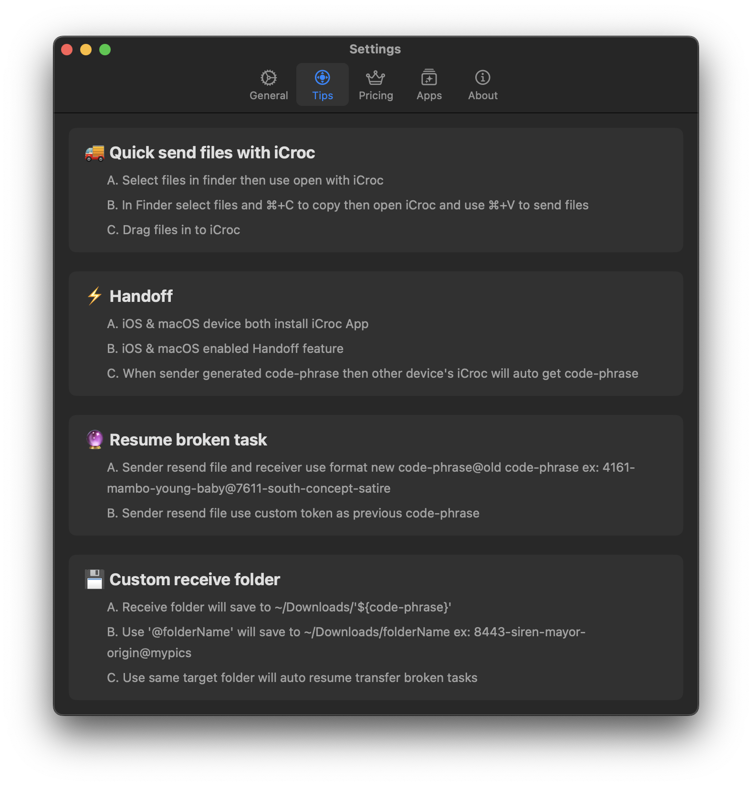

# README.md
- [Deutsch](README.de.md)
- [English](README.md)
- [Spanish](README.es.md)
- [French](README.fr.md)
- [Italian](README.it.md)
- [언어](README.ko.md)
- [日本語](README.ja.md)
- [简体中文](README.zh_cn.md)
- [繁体中文](README.zh_tw.md)

# iCroc - Croc CLI App für iOS und macOS

[Die neueste Version aus dem App Store herunterladen](https://apps.apple.com/us/app/id6444355962)

V1.3
---
- Die gesamte App-Oberfläche und Bedienlogik vollständig neu gestalten.
- Eingebettete Croc-Version auf v10.0.8 aktualisieren.
- Unterstützung für die Handoff-Funktion von iOS und macOS hinzufügen.
- Mehr Sprachen unterstützen.

V1.1
---
- App-Symbol neu gestalten.
- Fehlerbehebungen und Leistungsverbesserungen.

V1.0
---
Croc ist ein Werkzeug, das es zwei Computern ermöglicht, Dateien und Ordner einfach und sicher zu übertragen. Soweit ich weiß, ist Croc das einzige CLI-Dateiübertragungstool, das all dies bietet:

- Ermöglicht die Datenübertragung zwischen zwei beliebigen Computern (über ein Relais)
- Bietet Ende-zu-Ende-Verschlüsselung (unter Verwendung von PAKE)
- Ermöglicht einfache plattformübergreifende Übertragungen (Windows, Linux, Mac)
- Erlaubt mehrere Dateiübertragungen
- Ermöglicht die Wiederaufnahme unterbrochener Übertragungen
- Lokaler Server oder Port-Weiterleitung nicht erforderlich
- IPv6 zuerst mit IPv4-Fallback
- Kann Proxy verwenden, wie Tor

Die Kommandozeilenanwendung, auf der dies basiert, finden Sie hier:

https://github.com/schollz/croc

## iCroc in den macOS-Einstellungen aktivieren

# 🚚 Dateien schnell mit iCroc senden
- Dateien im Finder auswählen und dann mit iCroc öffnen
- Dateien im Finder auswählen und mit ⌘+C kopieren, dann iCroc öffnen und mit ⌘+V Dateien senden
- Dateien in iCroc ziehen

# ⚡ Handoff
- Sowohl auf iOS- als auch auf macOS-Geräten die iCroc-App installieren
- Handoff-Funktion auf iOS- und macOS-Geräten aktivieren
- Wenn der Absender eine Codephrase generiert, wird die Codephrase automatisch auf dem anderen Gerät empfangen

# 🔮 Unterbrochene Aufgaben wieder aufnehmen
- Der Absender sendet die Datei erneut und der Empfänger verwendet das Format neue Codephrase@alte Codephrase z.B.: 4161-mambo-young-baby@7611-south-concept-satire
- Der Absender sendet die Datei erneut und verwendet das vorherige Codephrase als benutzerdefinierten Token

# 💾 Benutzerdefinierter Empfangsordner
- Der Empfangsordner wird in ~/Downloads/'${code-phrase}' gespeichert
- Verwendung von '@folderName' speichert in ~/Downloads/folderName z.B.: 8443-siren-mayor-origin@mypics
- Verwendung desselben Zielordners ermöglicht die automatische Wiederaufnahme unterbrochener Übertragungen