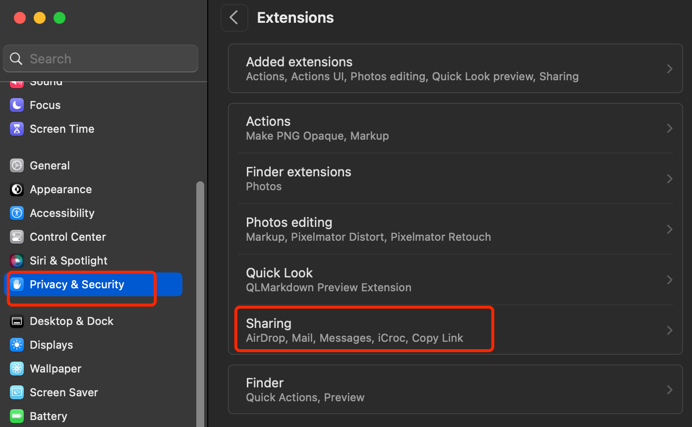
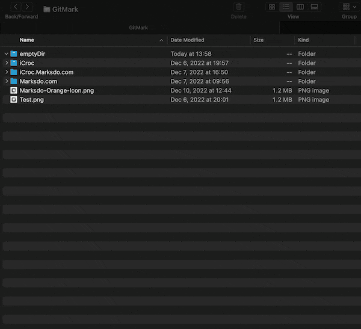
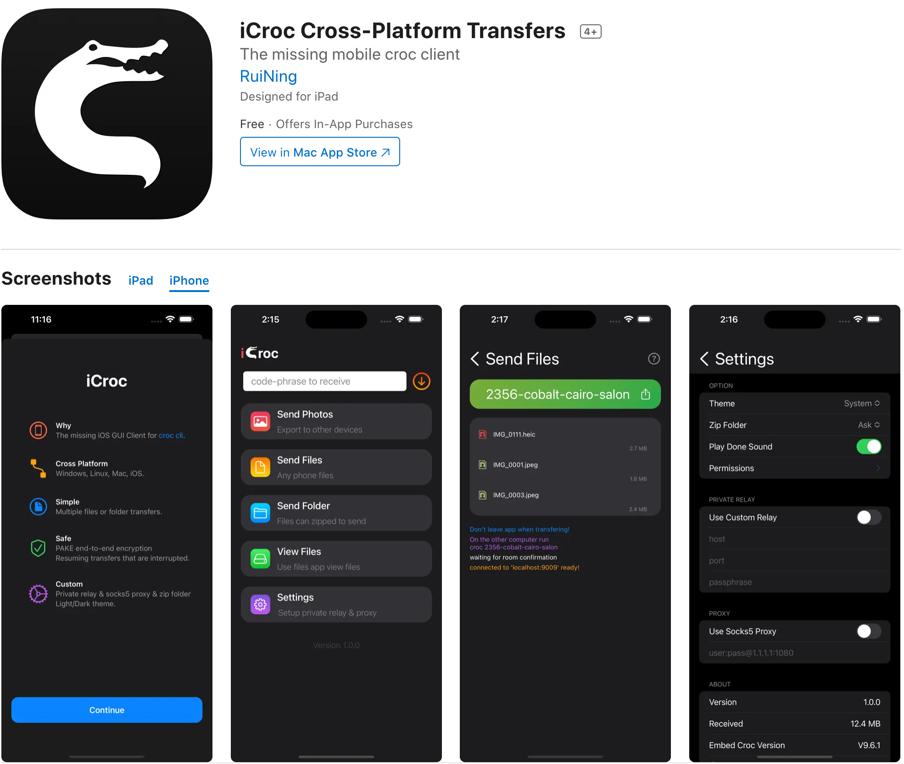

# README.md
- [Deutsch](README.de.md)
- [English](README.md)
- [Spanish](README.es.md)
- [French](README.fr.md)
- [Italian](README.it.md)
- [언어](README.ko.md)
- [日本語](README.ja.md)
- [简体中文](README.zh_cn.md)
- [繁体中文](README.zh_tw.md)

# iCroc - Croc cli App iOS GUI Client

Laden Sie die [neueste Version aus dem Appstore herunter](https://apps.apple.com/de/app/id6444355962)

V1.1
---
- Neugestaltung des App-Symbols
- Fehlerbehebungen und Leistungsverbesserungen

V1.0
---
Croc ist ein Tool, das es ermöglicht, Dateien und Ordner einfach und sicher zwischen zwei Computern zu übertragen. Nach meinem Kenntnisstand ist croc das einzige CLI-Dateiübertragungstool, das all folgendes bietet:

- ermöglicht Datenübertragung zwischen beliebigen zwei Computern (unter Verwendung eines Relais)
- bietet End-to-End-Verschlüsselung (unter Verwendung von PAKE)
- ermöglicht eine einfache plattformübergreifende Übertragung (Windows, Linux, Mac)
- ermöglicht mehrere Dateiübertragungen
- ermöglicht das Fortsetzen unterbrochener Übertragungen
- lokale Server oder Portweiterleitungen sind nicht erforderlich
- IPv6-First mit IPv4-Fallback
- kann Proxy verwenden, wie z.B. Tor

Die Befehlszeilenanwendung, auf der diese Anwendung basiert, finden Sie [hier](https://github.com/schollz/croc).

## Aktivieren von iCroc in den macOS-Einstellungen

## iCroc senden auf macOS

## iCroc empfangen auf macOS

