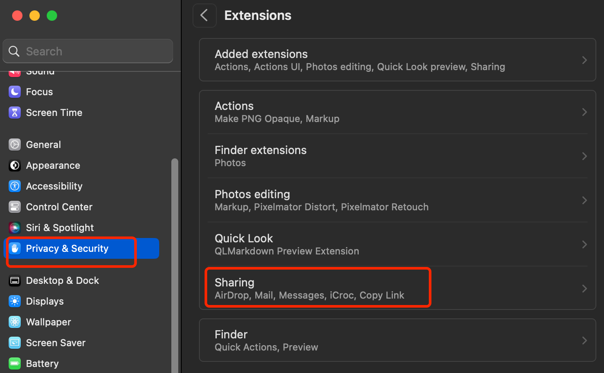
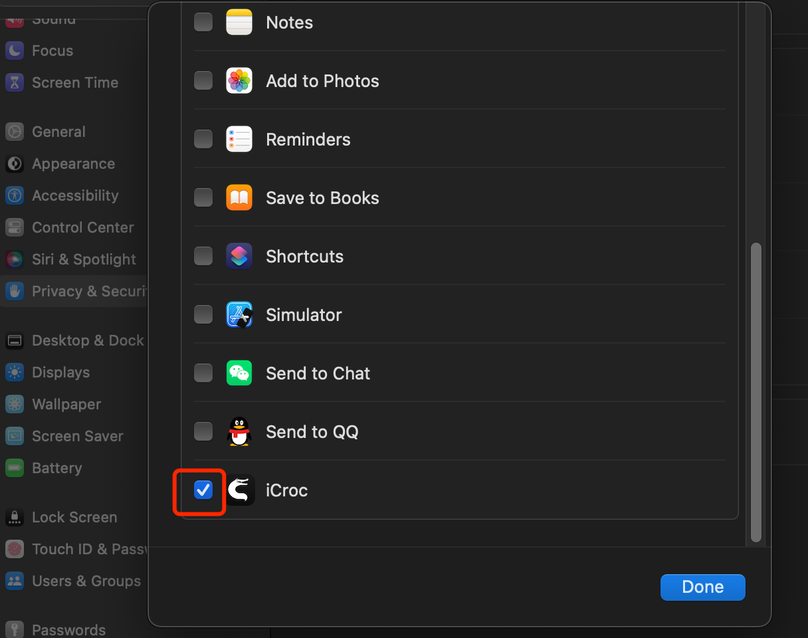
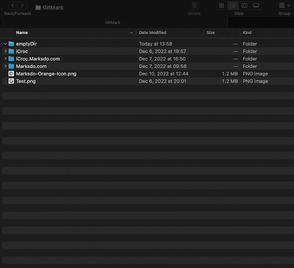
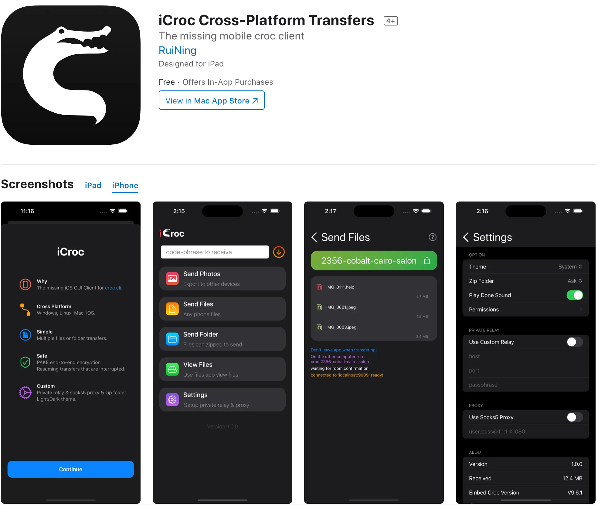

# README.md
- [Deutsch](README.de.md)
- [English](README.md)
- [Spanish](README.es.md)
- [French](README.fr.md)
- [Italian](README.it.md)
- [언어](README.ko.md)
- [日本語](README.ja.md)
- [简体中文](README.zh_cn.md)
- [繁体中文](README.zh_tw.md)

# iCroc - Aplicación de cliente GUI Croc CLI para iOS  
  
Descarga [la última versión desde la App Store](https://apps.apple.com/us/app/id6444355962)  
  
V1.1  
---  
- Rediseño del icono de la aplicación  
- Corrección de errores e mejoras de rendimiento.  
  
V1.0  
---  
croc es una herramienta que permite a dos computadoras transferir archivos y carpetas de manera simple y segura. Hasta donde yo sé, croc es la única herramienta de transferencia de archivos CLI que cumple con todos los siguientes requisitos:  
  
- Permite a cualquier dos computadoras transferir datos (utilizando un retransmisor)  
- Proporciona cifrado de extremo a extremo (utilizando PAKE)  
- Permite transferencias fáciles entre plataformas (Windows, Linux, Mac)  
- Permite transferencias de múltiples archivos  
- Permite reanudar transferencias interrumpidas  
- No se necesita servidor local ni reenvío de puertos  
- Admite IPv6 en primer lugar con respaldo a IPv4  
- Puede utilizar un proxy, como Tor  
  
La aplicación de línea de comandos en la que se basa se puede encontrar aquí:  
  
https://github.com/schollz/croc  
  
## Configuración activa de iCroc en macOS  
  
  
  
  
## Envío de iCroc en macOS  
  
  
## Recepción de iCroc en macOS  
  
  
