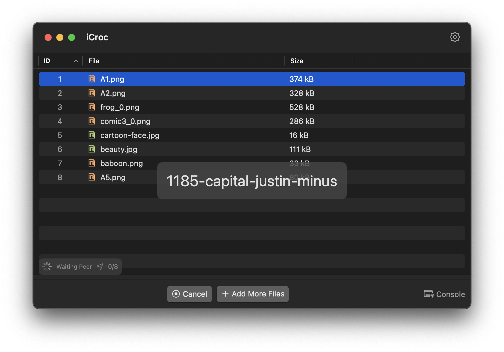

# README.md
- [English](README.md)
- [Deutsch](README.de.md)
- [Spanish](README.es.md)
- [Finnish](README.fi.md)
- [French](README.fr.md)
- [Italian](README.it.md)
- [Indonesian](README.id.md)
- [언어](README.ko.md)
- [日本語](README.ja.md)
- [简体中文](README.zh_cn.md)
- [繁体中文](README.zh_tw.md)
- [Norwegian](README.nb.md)
- [Dutch](README.nl.md)
- [Polish](README.pl.md)
- [Portuguese](README.pt.md)
- [Swedish](README.sv.md)
- [ภาษาไทย](README.th.md)
- [Turkish](README.tr.md)
- [Ukrainian](README.uk.md)
- [Vietnamese](README.vi.md)

# iCroc - iOS 및 macOS용 Croc CLI 앱

[앱스토어에서 최신 릴리스 다운로드](https://apps.apple.com/us/app/id6444355962)

V1.3
---
- 전체 앱 인터페이스 및 운영 로직을 완전히 재설계.
- 내장된 croc 버전을 v10.0.8로 업그레이드.
- iOS 및 macOS 핸드오프 기능 지원 추가.
- 더 많은 언어 지원.

V1.1
---
- 앱 아이콘 재디자인.
- 버그 수정 및 성능 개선.

V1.0
---
croc는 두 컴퓨터 간에 파일 및 폴더를 간단하고 안전하게 전송할 수 있는 도구입니다. 제가 아는 한, croc는 다음 모든 기능을 제공하는 유일한 CLI 파일 전송 도구입니다:

- 두 컴퓨터 간 데이터 전송을 허용 (중계 사용)
- 종단 간 암호화 제공 (PAKE 사용)
- 크로스 플랫폼 전송을 쉽게 지원 (Windows, Linux, Mac)
- 여러 파일 전송 허용
- 중단된 전송 재개 허용
- 로컬 서버 또는 포트 포워딩 불필요
- IPv6 우선, IPv4 백업
- tor와 같은 프록시 사용 가능

이 명령줄 애플리케이션의 소스 코드는 여기에서 찾을 수 있습니다:

https://github.com/schollz/croc

## macOS에서 iCroc 설정 활성화

# 🚚 iCroc로 파일 빠르게 보내기
- Finder에서 파일 선택 후 iCroc로 열기
- Finder에서 파일 선택 후 ⌘+C로 복사, iCroc 열기 후 ⌘+V로 파일 전송
- 파일을 iCroc으로 드래그하기

# ⚡ 핸드오프
- iOS 및 macOS 장치에 모두 iCroc 앱 설치
- iOS 및 macOS 핸드오프 기능 활성화
- 발신자가 코드 구문을 생성하면 다른 장치의 iCroc이 자동으로 코드 구문을 수신

# 🔮 중단된 작업 재개
- 발신자가 파일을 다시 보내고 수신자는 new code-phrase@old code-phrase 형식 사용 예: 4161-mambo-young-baby@7611-south-concept-satire
- 발신자는 이전 코드 구문을 사용자 지정 토큰으로 사용하여 파일을 다시 보냄

# 💾 사용자 지정 수신 폴더
- 수신 폴더는 ~/Downloads/'${code-phrase}'에 저장됨
- '@folderName'을 사용하여 ~/Downloads/folderName에 저장 예: 8443-siren-mayor-origin@mypics
- 동일한 대상 폴더를 사용하면 중단된 전송 작업 자동 재개
