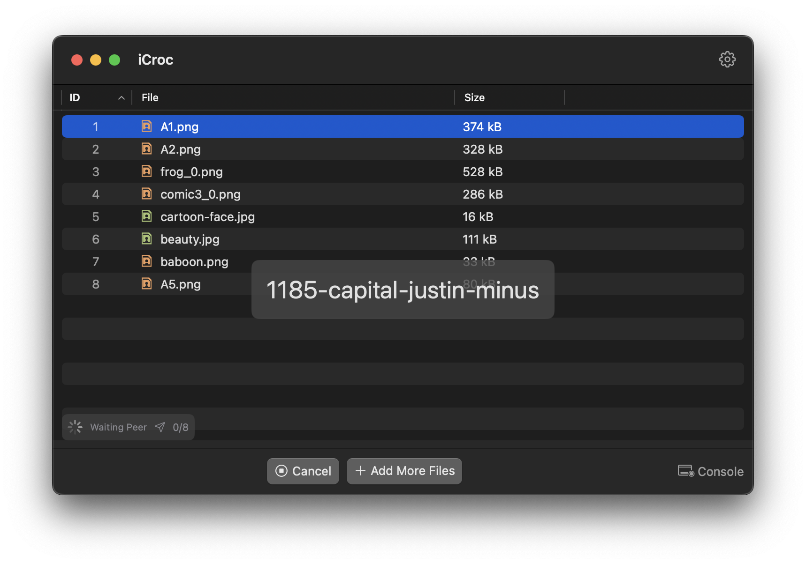
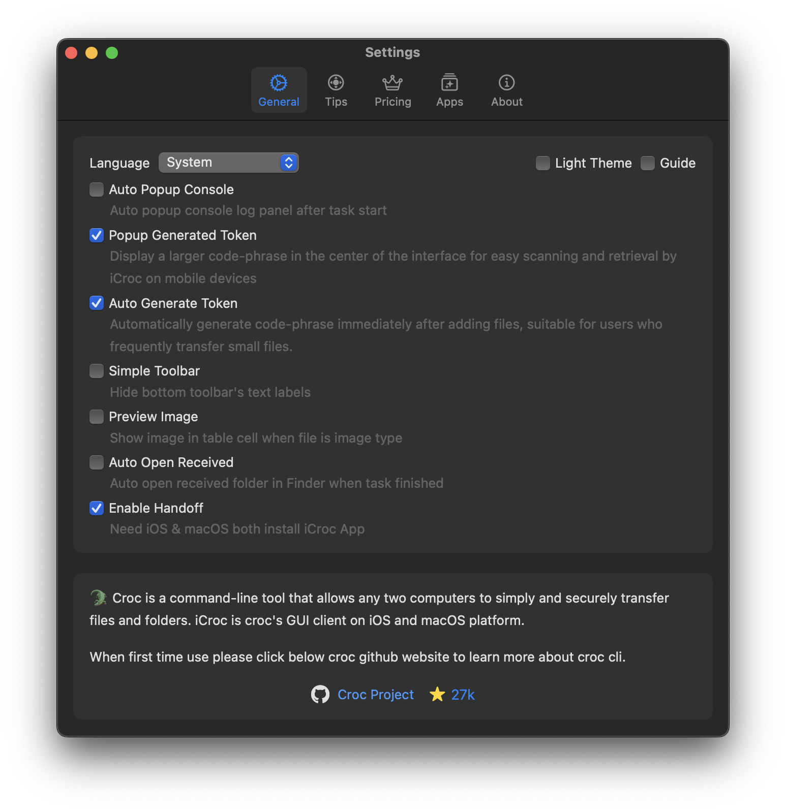
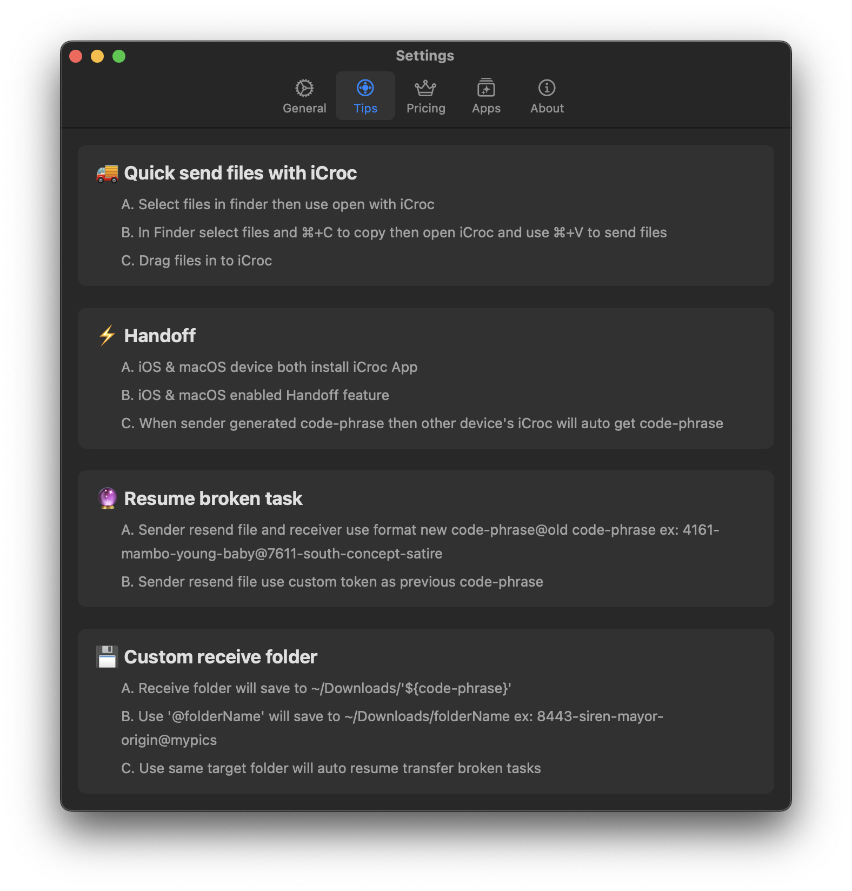

# README.md
- [English](README.md)
- [Deutsch](README.de.md)
- [Spanish](README.es.md)
- [Finnish](README.fi.md)
- [French](README.fr.md)
- [Italian](README.it.md)
- [Indonesian](README.id.md)
- [언어](README.ko.md)
- [日本語](README.ja.md)
- [简体中文](README.zh_cn.md)
- [繁体中文](README.zh_tw.md)
- [Norwegian](README.nb.md)
- [Dutch](README.nl.md)
- [Polish](README.pl.md)
- [Portuguese](README.pt.md)
- [Swedish](README.sv.md)
- [ภาษาไทย](README.th.md)
- [Turkish](README.tr.md)
- [Ukrainian](README.uk.md)
- [Vietnamese](README.vi.md)

# iCroc - Croc cli app for iOS & macOS

Download [the latest release from appstore](https://apps.apple.com/us/app/id6444355962)

V1.3
---
- Completely redesign the entire app interface and operation logic.
- Upgrade embed croc version to v10.0.8
- Add support iOS & macOS handoff feature
- Support more languages

V1.1
---
- App icon redesign
- Bug fixed and Performance improvements.

V1.0
---
croc is a tool that allows any two computers to simply and securely transfer files and folders. AFAIK, croc is the only CLI file-transfer tool that does all of the following:

- allows any two computers to transfer data (using a relay)
- provides end-to-end encryption (using PAKE)
- enables easy cross-platform transfers (Windows, Linux, Mac)
- allows multiple file transfers
- allows resuming transfers that are interrupted
- local server or port-forwarding not needed
- ipv6-first with ipv4 fallback
- can use proxy, like tor

The command line application upon which this is based can be found here:

https://github.com/schollz/croc

## macOS active iCroc in Settings

# 🚚 Quick send files with iCroc
- Select files in finder then use open with iCroc
- In Finder select files and ⌘+C to copy then open iCroc and use ⌘+V to send files
- Drag files in to iCroc

# ⚡ Handoff
- iOS & macOS device both install iCroc App
- iOS & macOS enabled Handoff feature
- When sender generated code-phrase then other device's iCroc will auto get code-phrase

# 🔮 Resume broken task
- Sender resend file and receiver use format new code-phrase@old code-phrase ex: 4161-mambo-young-baby@7611-south-concept-satire
- Sender resend file use custom token as previous code-phrase

# 💾 Custom receive folder
- Receive folder will save to ~/Downloads/'${code-phrase}'
- Use '@folderName' will save to ~/Downloads/folderName ex: 8443-siren-mayor-origin@mypics
- Use same target folder will auto resume transfer broken tasks

